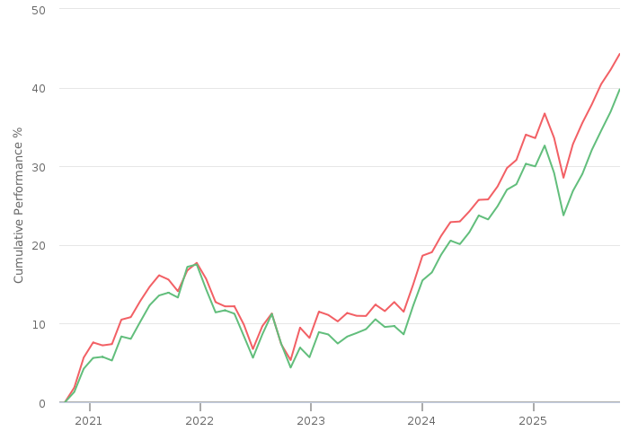
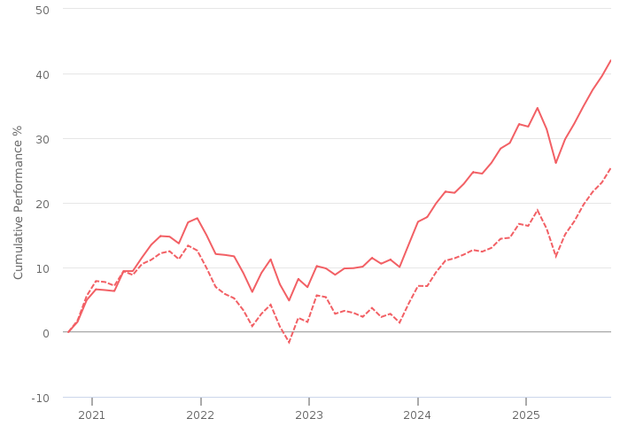
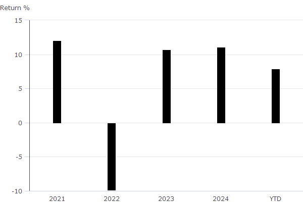
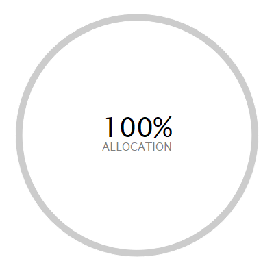

Summary for Mr xxxxxxx

Xxxxxxx

TFAS Wealth Ltd

13 October 2025	

Recommendation

**Investment:** £110,185 then £0 monthly

The agreed risk level considered your natural attitude to risk, capacity for loss and required return for your goal. 

| **5 Agreed risk level\[1\]** |  

\[1\] As a Balanced investor you do not see yourself as a particularly cautious person and have no strong positive or negative associations with the notion of taking risk.  If you have some experience of investments and a degree of understanding of financial matters then you may be suited to a Balanced approach to investing.  You may also be suited to this approach if you make investment decisions reasonably quickly and don’t tend to be particularly anxious about those decisions.  As a Balanced investor you can be inclined to look for a combination of investments with differing levels of risk and understand that you may need to take some risk to meet your investment goals.  

Investments

| **Investment** | **Provider** | **% Invested** |  
| CT Universal MAP Balanced Fund C Acc (GBP) | Columbia Threadneedle Fund Management Limited | 50.00 |  
| HSBC Global Strategy Balanced Portfolio Accumulation C (GBP) | HSBC Asset Management (Fund Services UK) Limited | 50.00 |

MiFID II pre-sale cost disclosure (ex-ante/estimated costs)

The below table illustrates the ex-ante MiFID II pre-sale cost disclosures for funds in scope of MiFID II which excludes Life & Pension funds. One off costs reflect the maximum entry and exit costs that the fund manager has stated they can charge over the period the fund is held. Where costs are on-going, such costs reflect a 12 month period.

**One-Off Costs** - Maximum costs incurred when entering or exiting the fund. These costs might be waived by the fund manager or distributor. One-Off Costs include: Initial Charge; Maximum Entry Cost Acquired; Maximum Exit Fee; and Maximum Exit Cost Acquired.

**Ongoing Costs** - The Annual Management Charge and other fund expenses for example, custodian fees; audit fees; legal fees; marketing distribution; and costs of underlying investments.

**Transaction Costs** - Costs incurred when buying or selling underlying investments. Includes both explicit costs for example dealing commission and can include implicit costs, for example slippage.

**Incidental Costs** - The impact of any performance fee.

| **Fund name** | **One-Off Costs\*** | **Ongoing Costs** | **Transaction Costs** | **Incidental Costs** | **Total** |  
| HSBC Global Strategy Balanced Portfolio Accumulation C | - | £99.17 (0.18%) | £2.75 (0.01%) | - | £101.92 (0.19%) |  
| CT Universal MAP Balanced Fund C Acc | - | £159.77 (0.29%) | £145.05 (0.26%) | - | £304.82 (0.55%) |  
| Total aggregated fund costs: | £0.00 (0.00%) | £258.93 (0.24%) | £147.80 (0.13%) | £0.00 (0.00%) | £406.74 (0.37%) |

\* ’One-Off Costs’ represent the maximum costs that can be incurred when entering or exiting the fund and might be waived by the fund manager or distributor.

Asset allocation

|  | **ASSET ALLOCATION⁽¹⁾ \| NET %⁽²⁾ \| SHORT % \| LONG % l \| North America Equity \| 35.49 \| 0.00 \| 35.49 l \| Global (ex-UK) Fixed Income \| 31.96 \| -5.48 \| 37.44 l \| UK Equity \| 9.42 \| 0.00 \| 9.42 l \| Europe (ex-UK) Equity \| 6.66 \| -0.72 \| 7.38 l \| Emerging Markets Equity \| 3.77 \| 0.00 \| 3.77 l \| Developed Pacific (ex-Japan) Equity \| 3.31 \| 0.00 \| 3.31 l \| UK Government Bonds \| 2.98 \| 0.00 \| 2.98 l \| Japan Equity \| 2.14 \| -0.29 \| 2.43 l \| Cash - Short Term Money Market \| 1.86 \| -4.11 \| 5.97 l \| UK Corporate Bonds \| 1.64 \| 0.00 \| 1.64 l \| UK Index Linked Bonds \| 1.13 \| 0.00 \| 1.13 l \| Other \| -0.37 \| -74.85 \| 74.48** |  
| ⁽¹⁾ Due to the negative asset allocation within the selected portfolio the investment allocation chart is unavailable. ⁽²⁾ Due to rounding there may be a discrepancy between the Long/Short % and the Net %. |  |

Investment performance

Individual cumulative investment performance graph

The chart shows an investment’s performance, calculated as NAV to NAV/Bid to Bid/Closing Price to Closing Price, with dividends/distributions reinvested, including the effect of ongoing costs and charges. These figures are calculated to the performance date 12 October 2025.

| **━━** | **CT Universal MAP Balanced Fund C Acc (GBP)** | **━━** | **HSBC Global Strategy Balanced Portfolio Accumulation C (GBP)** |  

Individual cumulative investment performance table

The table shows an investment’s performance, calculated as NAV to NAV/Bid to Bid/Closing Price to Closing Price, with dividends/distributions reinvested, including the effect of ongoing costs and charges. These figures are calculated to the month end performance date 30 September 2025.

| **FUND** | **3M** | **6M** | **1YR** | **3YR** | **5YR** | **10YR** |  
| CT Universal MAP Balanced Fund C Acc (GBP) | 4.89 | 9.55 | 11.17 | 36.66 | 44.73 |  |  
| HSBC Global Strategy Balanced Portfolio Accumulation C (GBP) | 6.15 | 9.87 | 9.92 | 32.52 | 40.06 | 122.95 |

Individual discrete investment performance table

The table shows an investments performance, calculated as NAV to NAV/Bid to Bid/Closing Price to Closing Price, with dividends / distributions reinvested, including the effect of ongoing costs and charges. These figures are calculated for calendar years and / or the period within the current year specified.

| **Fund** | **2021** | **2022** | **2023** | **2024** | **YTD** |  
| HSBC Global Strategy Balanced Portfolio Accumulation C | 12.68 | -10.52 | 10.43 | 10.82 | 7.7 |  
| CT Universal MAP Balanced Fund C Acc | 11.36 | -9.14 | 10.94 | 11.27 | 8.04 |

Product

| **Name** | **Provider** |  
| Pension Portfolio - Choice | Aviva Life & Pensions UK Limited |

Platform

| **Name** | **Provider** |  
| Aviva Platform | Aviva |

Research Report for Mr xxxxxxx 

xxxxxxx

TFAS Wealth Ltd

13 October 2025	

Contents

[Contents	2](#_Toc1)

[Risk profile	4](#_Toc2)

[**How are risk levels used to create suitable investment portfolios?**](#_Toc3)[	4](#_Toc3)

[Agreed risk level	5](#_Toc4)

[Investments selection	6](#_Toc5)

[Risk Rated investments	6](#_Toc6)

[Portfolio details	6](#_Toc7)

[Investments	6](#_Toc8)

[MiFID II pre-sale cost disclosure (ex-ante/estimated costs)	8](#_Toc9)

[Risk level	8](#_Toc10)

[Combined cumulative investment performance graph	9](#_Toc11)

[Combined cumulative investment performance table	9](#_Toc12)

[Individual cumulative investment performance graph	10](#_Toc13)

[Individual cumulative investment performance table	10](#_Toc14)

[Combined discrete investment performance graph	11](#_Toc15)

[Combined discrete investment performance table	11](#_Toc16)

[Individual discrete investment performance table	11](#_Toc17)

[Combined top ten holdings	13](#_Toc18)

[Asset allocation	14](#_Toc19)

[Filters	15](#_Toc3558338)

[Shortlist	15](#_Toc3558339)

[Product selection	17](#_Toc20)

[Selected Research Area	17](#_Toc21)

[Recommended Product	17](#_Toc22)

[Panel	18](#_Toc23)

[Template	18](#_Toc24)

[Filters	18](#_Toc25)

[Shortlist	19](#_Toc26)

[DNA features	20](#_Toc27)

[Platform selection	21](#_Toc28)

[Recommended Platform	21](#_Toc29)

[Panel	22](#_Toc30)

[Template	22](#_Toc31)

[Filters	22](#_Toc32)

[Shortlist	23](#_Toc33)

[DNA features	24](#_Toc34)

[Notes	25](#_Toc35)

In using this report you acknowledge that nothing in this report is, or shall be deemed to constitute, financial, investment or other advice or a recommendation or endorsement by Defaqto in respect of any product or service referred to herein. Your financial adviser, rather than Defaqto, will provide any such advice, recommendation or endorsement.

Risk profile

This section details how we reached an agreed risk level for this goal. It covers factors including your natural attitude to risk, capacity for loss and required return; factors used when selecting the types of investments and determining suitability.

**How are risk levels used to create suitable investment portfolios?**

The natural risk level, which is ascertained from the psychometric attitude to risk questionnaire score, is used as a starting point to discuss the actual level of risk you are willing and able to take to meet your specific investment objective.

In the discussion we had, you were shown a projection, based initially on your natural risk level, investment amount, target and desired time horizon. We then discussed this projection and altered any factor, including the risk level, until we agreed that the right balance had been achieved. This resulted in an agreed risk level for the investment.

To project the potential outcomes, each risk level is mapped to a collection of asset classes designed to expose you to an appropriate level of risk. Projections are produced by passing the asset class breakdown for the selected risk level to a stochastic engine that uses modelling provided by Hymans Robertson to project the future performance of the combination of asset classes. 

By using these projections and discussions, we came to an agreed risk level for your specific investment objective. A portfolio will be built to meet your agreed risk level.

A summary of the results of this process is documented below.

Agreed risk level

Following an interactive discussion, and considering your natural attitude to risk, capacity for loss and required return for your goal, we agreed a risk level. 

| **5  Balanced** |  | **As a Balanced investor you do not see yourself as a particularly cautious person and have no strong positive or negative associations with the notion of taking risk.  If you have some experience of investments and a degree of understanding of financial matters then you may be suited to a Balanced approach to investing.  You may also be suited to this approach if you make investment decisions reasonably quickly and don’t tend to be particularly anxious about those decisions.  As a Balanced investor you can be inclined to look for a combination of investments with differing levels of risk and understand that you may need to take some risk to meet your investment goals.** |  

.

Investments selection

**Investment:** £110,185 then £0 monthly

This section of the report details the issues identified as being important to the selection of investments and the other criteria used in selecting the most suitable investment.

Risk Rated investments

The risk rated funds selected were for the following mappings:

| **5 Balanced** |  | **A risk rated multi asset investment of level 5 targets longer term capital growth. Investment will be mainly in fixed interest, equities with a UK focus and also some alternative asset classes, mostly property. There will be some volatility in return for the possibility of higher long term returns.** |  

Portfolio details

### Investments

The client’s portfolio contains the following investments: 

| **Investment** | **Provider** | **ISIN** | **Risk controlled \[2\]** | **Diamond rating \[1\]** | **Family diamond rating \[1\]** | **% Invested** |  
| CT Universal MAP Balanced Fund C Acc (GBP) | Columbia Threadneedle Fund Management Limited | GB00BF99W060 |  | N/A |  | 50.00 |  
| HSBC Global Strategy Balanced Portfolio Accumulation C (GBP) | HSBC Asset Management (Fund Services UK) Limited | GB00B76WP695 |  | N/A |  | 50.00 |

**\[1\] Defaqto Diamond Rating**  
Diamond Ratings give managed funds an independent rating of 1 to 5 based on a detailed and well-structured scoring process allowing advisers and their clients to see where they sit in the market in terms of fund performance and competitiveness in other key areas such as cost, scale, access and manager longevity. 1 indicates the lowest rating across the characteristics and features while 5 is the highest.

Fund Diamond Ratings cover Multi Manager Funds across the 4 relevant IA sectors (Mixed 0-35%, Mixed 20-60%, Mixed 40-85% and Flexible), Directly invested funds across the 4 relevant IA sectors (Mixed 0-35%, Mixed 20-60%, Mixed 40-85% and Flexible) and Index Trackers.

Fund Family Diamond Ratings are split into Risk Targeted and Risk Focused ‘universes’, with the individual funds coming from the following IA sectors: Mixed 0-35%, Mixed 20-60%, Mixed 40-85%, Flexible, Specialist and Unclassified.   
  
MPS Diamond Ratings are quantitative ratings to help identify the most consistent portfolios in terms of 1 year discrete risk adjusted returns, over the preceding 5 year period. Ratings of 1 to 5 correspond to a portfolio’s respective quintile within the portfolio’s Defaqto MPS Comparator peer group. For example, a rating of 5 represents the top 20% of portfolios that have experienced the most consistent risk adjusted returns, over the preceding 5 years discrete period, within the Defaqto MPS Comparator peer group.

**\[2\] Risk Controlled**  
Risk controlled funds have been mandated to adhere to the Defaqto risk score it has been mapped against.

### MiFID II pre-sale cost disclosure (ex-ante/estimated costs)

The below table illustrates the ex-ante MiFID II pre-sale cost disclosures for funds in scope of MiFID II which excludes Life & Pension funds. One off costs reflect the maximum entry and exit costs that the fund manager has stated they can charge over the period the fund is held. Where costs are on-going, such costs reflect a 12 month period.

**One-Off Costs** - Maximum costs incurred when entering or exiting the fund. These costs might be waived by the fund manager or distributor. One-Off Costs include: Initial Charge; Maximum Entry Cost Acquired; Maximum Exit Fee; and Maximum Exit Cost Acquired.

**Ongoing Costs** - The Annual Management Charge and other fund expenses for example, custodian fees; audit fees; legal fees; marketing distribution; and costs of underlying investments.

**Transaction Costs** - Costs incurred when buying or selling underlying investments. Includes both explicit costs for example dealing commission and can include implicit costs, for example slippage.

**Incidental Costs** - The impact of any performance fee.

| **Fund name** | **One-off costs\*** | **Ongoing costs** | **Transaction costs** | **Incidental costs** | **Total** |  
| HSBC Global Strategy Balanced Portfolio Accumulation C | - | £99.17 (0.18%) | £2.75 (0.01%) | - | £101.92 (0.19%) |  
| CT Universal MAP Balanced Fund C Acc | - | £159.77 (0.29%) | £145.05 (0.26%) | - | £304.82 (0.55%) |  
| Total aggregated fund costs: | £0.00 (0.00%) | £258.93 (0.24%) | £147.80 (0.13%) | £0.00 (0.00%) | £406.74 (0.37%) |

\* ’One-Off Costs’ represent the maximum costs that can be incurred when entering or exiting the fund and might be waived by the fund manager or distributor.

### Risk level

The client’s agreed risk level is 5. The risk mapping of the new portfolio is 5 which matches the client’s agreed risk level.

### Combined cumulative investment performance graph

The chart shows the combined investments performance, calculated as NAV to NAV/Bid to Bid/Closing Price to Closing Price, with dividends/distributions reinvested, including the effect of ongoing costs and charges. These figures are calculated to the performance date 12 October 2025.

| **━━** | **Combined** | **---** | **Benchmark : Risk Level 5 Benchmark (GBP)** |  

### Combined cumulative investment performance table

The table shows the combined investments performance, calculated as NAV to NAV/Bid to Bid/Closing Price to Closing Price, with dividends/distributions reinvested, including the effect of ongoing costs and charges. These figures are calculated to the month end performance date 30 September 2025.

| **FUND** | **3M** | **6M** | **1YR** | **3YR** | **5YR** | **10YR** |  
| Combined Performance (GBP) | 5.52 | 9.71 | 10.54 | 34.59 | 42.40 | - |

### Individual cumulative investment performance graph

The chart shows an investment’s performance, calculated as NAV to NAV/Bid to Bid/Closing Price to Closing Price, with dividends/distributions reinvested, including the effect of ongoing costs and charges. These figures are calculated to the performance date 12 October 2025.

| **━━** | **CT Universal MAP Balanced Fund C Acc (GBP)** | **━━** | **HSBC Global Strategy Balanced Portfolio Accumulation C (GBP)** |  

### Individual cumulative investment performance table

The table shows an investment’s performance, calculated as NAV to NAV/Bid to Bid/Closing Price to Closing Price, with dividends/distributions reinvested, including the effect of ongoing costs and charges. These figures are calculated to the month end performance date 30 September 2025.

| **FUND** | **3M** | **6M** | **1YR** | **3YR** | **5YR** | **10YR** |  
| CT Universal MAP Balanced Fund C Acc (GBP) | 4.89 | 9.55 | 11.17 | 36.66 | 44.73 |  |  
| HSBC Global Strategy Balanced Portfolio Accumulation C (GBP) | 6.15 | 9.87 | 9.92 | 32.52 | 40.06 | 122.95 |

### Combined discrete investment performance graph

The chart shows the combined investments performance, calculated as NAV to NAV/Bid to Bid/Closing Price to Closing Price, with dividends/distributions reinvested, including the effect of ongoing costs and charges. These figures are calculated for calendar years and/or the period within the current year specified.

### Combined discrete investment performance table

| **Fund** | **2021** | **2022** | **2023** | **2024** | **YTD** |  
| Combined Discrete Performance (GBP) | 12.02 | -9.83 | 10.68 | 11.05 | 7.87 |

### Individual discrete investment performance table

The table shows an investments performance, calculated as NAV to NAV/Bid to Bid/Closing Price to Closing Price, with dividends / distributions reinvested, including the effect of ongoing costs and charges. These figures are calculated for calendar years and / or the period within the current year specified.

| **Fund** | **2021** | **2022** | **2023** | **2024** | **YTD** |  
| HSBC Global Strategy Balanced Portfolio Accumulation C | 12.68 | -10.52 | 10.43 | 10.82 | 7.7 |  
| CT Universal MAP Balanced Fund C Acc | 11.36 | -9.14 | 10.94 | 11.27 | 8.04 |

### Combined top ten holdings

The table shows the combined investments top ten holdings for the portfolio.  

| **Name** | **Portfolio %** |  
| HSBC American Index Institutional Acc | 14.66 |  
| HSBC Global Liq Sterling Liquidity Y | 3.70 |  
| Hsbc Global Funds Icav - Us Tr Inc | 3.55 |  
| HSBC Global Corporate Bond ETF ZQHUSD | 3.10 |  
| HSBC MSCI Emerg Mkts ETF | 3.04 |  
| Ultra 10 Year US Treasury Note Future Sept 25 | 2.81 |  
| HSBC European Index Institutional Acc | 2.74 |  
| HSBC US Corporate Bond ETF ZQ USD Inc | 2.39 |  
| HSBC S&P 500 ETF | 2.36 |  
| HSBC FTSE EPRA/NAREIT Developed ETF | 2.30 |

### Asset allocation

|  | **ASSET ALLOCATION⁽¹⁾ \| NET %⁽²⁾ \| SHORT % \| LONG % l \| North America Equity \| 35.49 \| 0.00 \| 35.49 l \| Global (ex-UK) Fixed Income \| 31.96 \| -5.48 \| 37.44 l \| UK Equity \| 9.42 \| 0.00 \| 9.42 l \| Europe (ex-UK) Equity \| 6.66 \| -0.72 \| 7.38 l \| Emerging Markets Equity \| 3.77 \| 0.00 \| 3.77 l \| Developed Pacific (ex-Japan) Equity \| 3.31 \| 0.00 \| 3.31 l \| UK Government Bonds \| 2.98 \| 0.00 \| 2.98 l \| Japan Equity \| 2.14 \| -0.29 \| 2.43 l \| Cash - Short Term Money Market \| 1.86 \| -4.11 \| 5.97 l \| UK Corporate Bonds \| 1.64 \| 0.00 \| 1.64 l \| UK Index Linked Bonds \| 1.13 \| 0.00 \| 1.13 l \| Other \| -0.37 \| -74.85 \| 74.48** |  
| ⁽¹⁾ Due to the negative asset allocation within the selected portfolio the investment allocation chart is unavailable. ⁽²⁾ Due to rounding there may be a discrepancy between the Long/Short % and the Net %. |  |

Filters

The following are the criteria applied to select the most suitable investments. 

| **Investment(s)** | **CT Universal MAP Balanced Fund C Acc (GBP)** |  
| Panel | TFAS |  
| Filter settings | Currency is GBP |  
| Sort settings | 1. Ongoing Charges, ASC 2. 3 Yr Cum. Return, DESC 3. 5 Yr Cum. Return, DESC 4. 5 Yr Ann. Return, DESC |

| **Investment(s)** | **HSBC Global Strategy Balanced Portfolio Accumulation C (GBP)** |  
| Panel | TFAS |  
| Filter settings | Currency is GBP |  
| Sort settings | 1. Ongoing Charges, ASC 2. 3 Yr Cum. Return, DESC 3. 5 Yr Cum. Return, DESC 4. 5 Yr Ann. Return, DESC |

Shortlist

6 investments from a total of 6 risk level  investments, as rated by Defaqto, matched the filters applied.

| **Investment** | **Provider** | **ISIN** | **Risk controlled** | **Diamond rating** |  
| CT Sustainable Universal MAP Balanced C Acc | Columbia Threadneedle Fund Management Limited | GB00BKV44860 |  | N/A |  
| CT Universal MAP Balanced Fund C Acc | Columbia Threadneedle Fund Management Limited | GB00BF99W060 |  | N/A |  
| CT Universal MAP Income Fund C Inc | Columbia Threadneedle Fund Management Limited | GB00BK5ZC812 |  |  |  
| HSBC Global Strategy Balanced Portfolio Accumulation C | HSBC Asset Management (Fund Services UK) Limited | GB00B76WP695 |  | N/A |  
| Legal & General Multi-Index 5 Fund I Class Accumulation | Legal & General (Unit Trust Managers) Ltd | GB00B8VZ3F59 |  | N/A |  
| Vanguard LifeStrategy 60% Equity Fund A Acc | Vanguard Investments UK, Limited | GB00B3TYHH97 |  |  |

The funds data used within Defaqto Engage is sourced from Morningstar UK. 

**Morningstar UK Data Disclaimer**  
The data and calculations contained herein are: (i) proprietary to Morningstar; (ii) not warranted to be accurate, complete or timely; and (iii) provided to you by Defaqto Engage at your own risk. You agree that neither Morningstar nor Defaqto Engage is responsible for any damages or losses arising from any use of this information and that the information must not be relied upon by you, the user, without appropriate verification. Morningstar and Defaqto Engage inform you as follows: (i) no investment decision should be made in relation to any of the information provided other than on the advice of a professional financial adviser; (ii) past performance is no guarantee of future results; and (iii) the value and income derived from investments can go down as well as up.

Data and Calculations: © 2025  Morningstar UK. All Rights Reserved.

Product selection

This section details the issues identified as being important to the selection of a product and the other criteria used in selecting the most suitable product.

Selected Research Area

The selected research area is SIPP

Recommended Product

No additional justification text has been entered

| **Product / Provider** | **Pension Portfolio - Choice Aviva Life & Pensions UK Limited** |  
| Product type | Pension Portfolio - Choice |  
| Profile | The Aviva brand name was launched in July 2002. The group was formed by the merger of CGU and Norwich Union in 2000. CGU came from the merger of Commercial Union and General Accident in 1998.   Aviva provide savings, retirement and insurance to 18 million (as at 31st December 2020) customers in their core markets (UK & Ireland Life, General Insurance: UK & Ireland, General Insurance: Canada). |

Panel

The Whole of Market has been used in the product selection.

Template

No template has been used in the product selection.

Filters

The table below lists the filters applied and the feature value for the recommended product.

| **Feature** | **Filter** | **Recommended feature value** |  
| Adviser Product | Product available via Advisers | Yes |  
| AKG Financial Strength | DNA 5 - A rating of 'A' denotes superior financial strength  DNA 4 - A rating of 'B+' denotes very strong financial strength  DNA 3 - A rating of 'B' denotes strong financial strength  DNA 2 - A rating of 'B-' denotes effective financial strength | B+ |  
| FAD (Flexi Access Drawdown) | DNA 5 - Flexi access drawdown facility available | Yes |  
| Uncrystallised Funds Pension Lump Sum | DNA 5 - Uncrystallised Funds Pension Lump Sum facility available | Yes |  
| Model Portfolio Adviser Led | DNA 5 - Adviser is able to build their own portfolios | Yes |  
| Adviser Platform Open Market | DNA 1 - Open market appointment of adviser platform is not possible | No |

Shortlist

1 products from a total of 118 matched the filters applied.

| **Product name** | **Provider name** | **Total DNA for DNA features analysed** |  
| Pension Portfolio - Choice | Aviva Life & Pensions UK Limited | No DNA applied |

DNA features

Quantitative benchmarking enabling detailed product feature analysis

Defaqto’s unique quantitative Data Numerical Analysis (DNA) helps you benchmark products based on the features they offer.

A value is applied to each feature within a product, helping you filter out products with features that are unsuitable for your client.

No Product DNA analysis was carried out.

Platform selection

This section details the issues identified as being important to the selection of a platform and the other criteria used in selecting the most suitable platform.

Recommended Platform

No additional justification text has been entered

| **Product / Provider** | **Aviva Platform Aviva** |  
| Profile | Aviva is the largest insurance group in the UK is also a provider of life and pensions products to Europe.    The Aviva brand name was launched in July 2002. The group was formed by the merger of CGU and Norwich Union in 2000. CGU came from the merger of Commercial Union and General Accident in 1998.   Aviva provide savings, retirement and insurance. |

Panel

The TFAS panel has been used in the platform selection.

Template

No template has been used in the product selection.

Filters

The table below lists the filters applied and the feature value for the recommended platform.

| **Feature** | **Filter** | **Recommended feature value** |  
| No filters were applied | No filters were applied | No filters were applied |

Shortlist

4 products from a total of 4 matched the filters applied.

| **Product name** | **Provider name** | **Total DNA for DNA features analysed** |  
| Aviva Platform | Aviva | No DNA applied |  
| Elevate | Aberdeen | No DNA applied |  
| Aegon Retirement Choices (ARC) | Aegon | No DNA applied |  
| Wealthtime Platform | Wealthtime | No DNA applied |

DNA features

Quantitative benchmarking enabling detailed product feature analysis

Defaqto’s unique quantitative Data Numerical Analysis (DNA) helps you benchmark products based on the features they offer.

A value is applied to each feature within a product, helping you filter out products with features that are unsuitable for your client.

No Platform DNA analysis was carried out.

Notes

KEY: na = not applicable, ns = not stated, nd = not disclosed

The Data Numerical Analysis (DNA) allows the analysis of data on both a quantitative and a qualitative basis, showing not only who does what, but more importantly, how well they do it. This is achieved by a system of benchmarking or ranking on a 1 to 5 basis called DNA. A score of 1 indicates a weak feature; a score of 5 indicates an excellent feature. 
