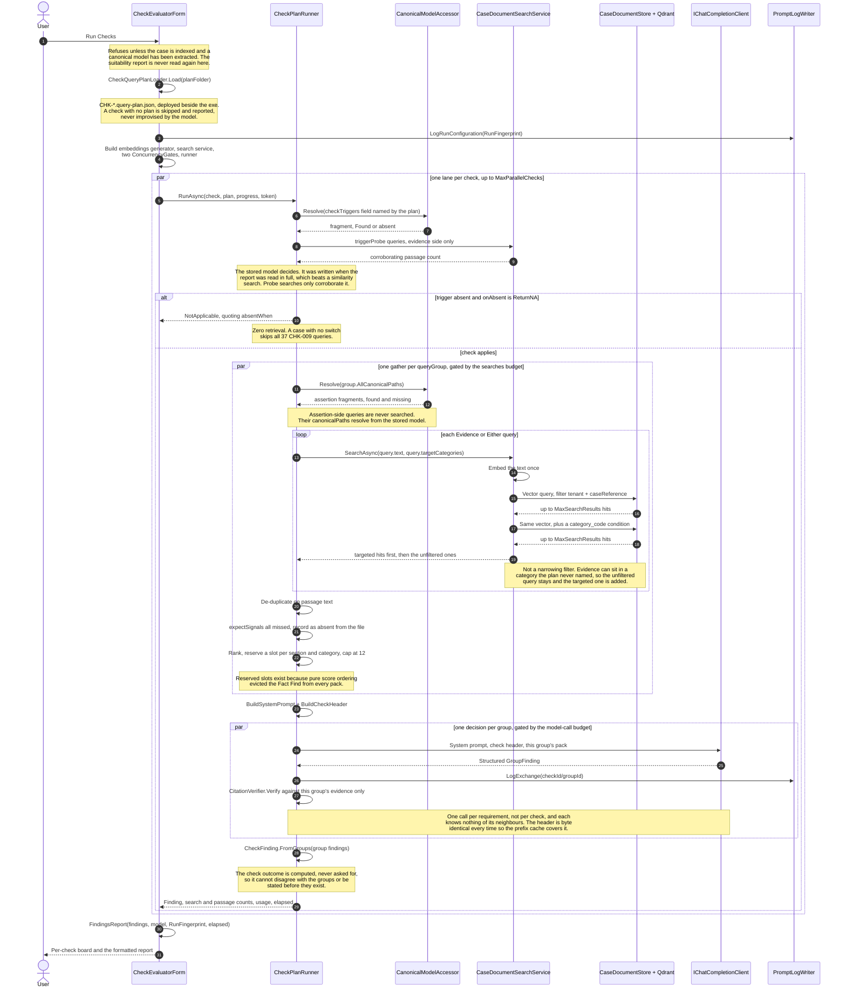

# Artifacts — Canonical Suitability Model v1.0

Derived from the QA assessment checks (CHK-001 … CHK-010), the A–I document category taxonomy, the example suitability report, and Intelliflo Office resource shapes in `consolidated-swagger.json`.

**These are not documentation only — the app reads two of them at run time.** `AiPromptEvaluator.csproj` copies `canonical-suitability-model.schema.json` and `check-plan/*.query-plan.json` beside the executable on build, so a fresh clone works with no configuration. Editing a query plan here changes what the next check run retrieves. Both locations are overridable under Settings → Canonical model.

| File | What it is |
|---|---|
| [canonical-suitability-model.md](canonical-suitability-model.md) | The design document: why the model is shaped this way, structure, provenance approach, extraction guidance, limitations. **Start here.** |
| [canonical-suitability-model.schema.json](canonical-suitability-model.schema.json) | JSON Schema (draft 2020-12) — the machine-readable contract for LLM extraction output. **Deployed with the app.** |
| [check-coverage-matrix.csv](check-coverage-matrix.csv) | Every check requirement → canonical path → evidence categories → trigger. 85 rows, one per query-plan group, covering all 10 checks and both limbs. Generated from the plans, so the two cannot drift |
| [io-resource-mapping.md](io-resource-mapping.md) | Canonical field → Intelliflo Office schema mapping, including which enumerations are copied verbatim and which constructs deliberately have no Office equivalent |
| [examples/suitability-report-test-1.extract.json](examples/suitability-report-test-1.extract.json) | Worked instance from a five-plan pension consolidation report; validates against the schema |
| [check-plan/](check-plan/) | Semantic-search query plans, one per check — 85 query groups, 297 queries. **Deployed with the app.** |

## How the app uses this

`Extract Model` parses the case's category I documents into an instance of the schema and stores it in SQLite against the case reference and tenant. `Run Check` then works from that stored model — the suitability report is never sent to a model a second time.

Each query plan splits every requirement into two sides, and the runner executes them from different places:

- `side: "Assertion"` — what the report claims → resolved from the stored canonical model by canonical path
- `side: "Evidence"` / `"Either"` — what the rest of the case file holds → retrieved from the vector store

The plan chooses the searches, not the model, so two runs over the same case retrieve the same evidence.

## The workflow, end to end

Two pre-steps have to have happened before a check can run, and the run refuses to start without them. Source: [check-run-workflow.mmd](check-run-workflow.mmd).

**Reading the shapes:** rectangles are actions, diamonds are branches, **cylinders are where data comes to rest** — Qdrant, SQLite, the PDF conversion cache and the prompt log. Dashed edges are reads and writes against those stores; dotted-outline nodes are paths that stop.

```mermaid
flowchart TD
    classDef store stroke-width:2px,stroke-dasharray:0
    classDef cache stroke-dasharray:4 3
    classDef skip stroke-dasharray:2 2

    %% ─────────────────────────────────────────────────────────────
    subgraph PRE1["PRE-STEP 1 &nbsp;·&nbsp; Load Docs &nbsp;—&nbsp; case file into the semantic store"]
        direction TB
        S1["Case folder<br/>sub-folders A to I carry the category code"]
        S2["Convert to Markdown<br/>Word and PDF via Docling, spreadsheets via SpreadsheetToMarkdownConverter"]
        S2C[("PDF conversion cache<br/>TEMP/AiPromptEvaluator/pdf-cache<br/>reused while the source file is unchanged")]
        S3{"Markdown?"}
        S3N["Skipped and named in the output<br/>never silently dropped"]
        S4["Delete every chunk for this case and tenant<br/>a reload replaces, it does not merge"]
        S5["Semantic chunking<br/>cut points found by embedding every element"]
        S6["Embed chunks, batches of 64"]
        S7[("Qdrant collection<br/>payload: tenant_id, case_reference, category_code<br/>category_code is indexed")]

        S1 --> S2 -.->|"hit"| S2C
        S2C -.->|"miss: convert and store"| S2
        S2 --> S3
        S3 -->|"no"| S3N
        S3 -->|"yes"| S4 --> S5 --> S6 --> S7
    end

    %% ─────────────────────────────────────────────────────────────
    subgraph PRE2["PRE-STEP 2 &nbsp;·&nbsp; Extract Model &nbsp;—&nbsp; suitability report into the canonical model"]
        direction TB
        E1["Read category I documents<br/>the suitability report and any letter"]
        E2{"Any category I<br/>Markdown found?"}
        E2N["Stop: nothing to extract from"]
        E3["Slice the canonical schema per section<br/>one pass per section, not one prompt for the whole model"]
        E4["Extract section<br/>identity registry carried forward so passes agree on ids"]
        E5{"More sections?"}
        E6["Merge fragments, validate against the schema"]
        E7[("SQLite<br/>keyed by case reference + tenant<br/>this is the report's only reading")]

        E1 --> E2
        E2 -->|"no"| E2N
        E2 -->|"yes"| E3 --> E4 --> E5
        E5 -->|"yes"| E4
        E5 -->|"no"| E6 --> E7
    end

    %% ─────────────────────────────────────────────────────────────
    subgraph RUN["RUN CHECKS"]
        direction TB
        R0{"Case indexed<br/>and model stored?"}
        R0N["Refuse and say which pre-step is missing"]
        R1["Load CHK-*.query-plan.json"]
        R1V{"planVersion<br/>supported?"}
        R1N["Plan refused by name, check skipped"]
        R2["Write the run fingerprint before the first prompt"]
        R2L[("Prompt log file<br/>written up front, so a cancelled run still says what it was")]
        R3["Fan out over checks, up to MaxParallelChecks"]

        R0 -->|"no"| R0N
        R0 -->|"yes"| R1 --> R1V
        R1V -->|"no"| R1N
        R1V -->|"yes"| R2 --> R2L
        R2 --> R3
    end

    %% ─────────────────────────────────────────────────────────────
    subgraph CHECK["PER CHECK"]
        direction TB
        T1["Resolve the plan's checkTriggers field"]
        T2["Run the trigger probe searches"]
        T3{"Trigger present?"}
        T4{"onAbsent"}
        T4A["Return N/A, quoting absentWhen<br/>ZERO retrieval"]
        T4B["Continue, and say the trigger was absent<br/>so an overlay is not read as excused"]
        G0["Fan out over query groups"]

        T1 --> T2 --> T3
        T3 -->|"yes"| G0
        T3 -->|"no"| T4
        T4 -->|"ReturnNA"| T4A
        T4 -->|"ContinueWithReducedScope"| T4B --> G0
        T4 -->|"Continue"| G0
    end

    %% ─────────────────────────────────────────────────────────────
    subgraph GROUP["PER GROUP &nbsp;·&nbsp; gather"]
        direction TB
        Q1{"query.side"}
        QA["Resolve canonicalPaths<br/>NOT searched"]
        QP{"CoreQueriesOnly<br/>and Supplementary?"}
        QPN["Query not run"]
        QE["Embed the query text once"]
        QE1["Qdrant query 1: tenant + case only"]
        QE2["Qdrant query 2: tenant + case + category_code"]
        QM["Merge, targeted hits first"]
        QD["De-duplicate on passage text<br/>not its hash, which is per-process seeded"]
        QS{"any expectSignals<br/>present?"}
        QSN["Record as ABSENT FROM THE FILE<br/>not merely unretrieved"]
        QR["Rank, then reserve slots:<br/>declared sections, declared categories, then targeted<br/>cap at 12"]
        QC{"categories reached<br/>&lt; minEvidenceCategories?"}
        QCN["Evidence shortfall stated in code"]
        PACK["Evidence pack"]

        Q1 -->|"Assertion"| QA --> PACK
        Q1 -->|"Evidence / Either"| QP
        QP -->|"yes"| QPN
        QP -->|"no"| QE --> QE1 --> QM
        QE --> QE2 --> QM
        QM --> QD --> QS
        QS -->|"none"| QSN --> QR
        QS -->|"some"| QR
        QR --> QC
        QC -->|"yes"| QCN --> PACK
        QC -->|"no"| PACK
    end

    %% ─────────────────────────────────────────────────────────────
    subgraph DECIDE["PER GROUP &nbsp;·&nbsp; decide"]
        direction TB
        D0{"comparison.method<br/>numeric?"}
        D0Y["Figures checked in code<br/>every asserted number against every passage number"]
        D1["Build the prompt: check header, assertions, passages,<br/>guards, sufficiency, decision rubric"]
        D2["ONE model call for this group<br/>knows nothing of its neighbours"]
        D3["Verify citations against THIS group's evidence only"]
        D4["Group finding<br/>+ shortfall attached by the runner, not the model"]

        D0 -->|"ValueMatch / RangeMatch"| D0Y --> D1
        D0 -->|"other"| D1
        D1 --> D2 --> D3 --> D4
    end

    %% ─────────────────────────────────────────────────────────────
    subgraph OUT["ROLL UP"]
        direction TB
        O1["Check outcome COMPUTED from the group findings<br/>never asked for, so it cannot disagree with them"]
        O2["Findings collected by position<br/>report order matches the plan, not the interleaving"]
        O3["Findings report + run fingerprint"]
        O1 --> O2 --> O3
    end

    S7 -.->|"read by every evidence query"| QE1
    E7 -.->|"read by every assertion query"| QA
    R3 --> T1
    G0 --> Q1
    PACK --> D0
    D4 --> O1
    T4A --> O2
    D2 -.->|"prompt and response"| R2L

    class S2C,S7,E7,R2L store
    class S3N,QPN,R0N,R1N,E2N skip
```



### Pre-step 1 — Load Docs

The case folder's sub-folders **are** the category taxonomy: a file under `B/` is category B, which is what every plan's `targetCategories` later filters on. Three things about this step matter downstream:

- **Only Markdown is indexed.** Anything else is skipped and named in the output rather than silently dropped, so a case that looks indexed but is missing its PDFs says so. Conversion is a prior step; its output is what lands in the folder.
- **The PDF conversion cache** under `TEMP/AiPromptEvaluator/pdf-cache` is reused while the source file is unchanged, so re-running a case does not re-convert it.
- **A reload replaces rather than merges.** Every chunk for the case and tenant is deleted before the first new one is written — chunking embeds as it goes, so a half-finished reload would otherwise leave the store holding two generations of the same document.

Chunking is semantic, not fixed-width: the chunker embeds every element to find its cut points, which is the larger half of what indexing costs. Chunks are then embedded in batches of 64 and written to Qdrant with `tenant_id`, `case_reference` and `category_code` in the payload. `category_code` carries a keyword index — that is what makes the plans' category-filtered second query possible.

### Pre-step 2 — Extract Model

The suitability report and any covering letter live in category `I`, and this is **the only time they are read**. Extraction runs one pass per schema section rather than one prompt for the whole model, carrying an identity registry forward so a later pass names an arrangement the same way an earlier one did. The merged result is validated against the canonical schema and stored in SQLite against the case reference and tenant.

Every `side: "Assertion"` query in every plan resolves against that stored model. The report is never sent to a model a second time, which is why a check cannot quietly re-interpret it.

### The run

The branches worth tracing:

| Branch | Both ways |
|---|---|
| **Preconditions** | No index or no stored model → the run refuses and says which pre-step is missing |
| **`planVersion`** | Unsupported → that plan is refused by name and its check skipped, rather than half-read |
| **Trigger** | `ReturnNA` on a missing trigger → the check ends with **zero retrieval**; `ContinueWithReducedScope` → runs anyway and says the trigger was absent, so an overlay is not read as excused |
| **`side`** | `Assertion` → resolved from SQLite, never searched. `Evidence`/`Either` → embedded once, then **two** Qdrant queries, unfiltered and category-filtered, targeted hits first |
| **`priority`** | With `CoreQueriesOnly` set, a Supplementary query is not run at all |
| **`expectSignals`** | None present in any hit → the data point is recorded as *absent from the file*, not merely unretrieved |
| **`minEvidenceCategories`** | Fewer categories reached than the plan asked for → the shortfall is stated in code and attached to the finding by the runner, not the model |
| **`comparison.method`** | `ValueMatch`/`RangeMatch` → figures are checked in code before the model is asked anything |

The two properties the shape exists to protect: **the plan chooses every search**, so two runs over the same case retrieve the same evidence; and **the check's outcome is computed** from its group findings rather than asked for, so it cannot disagree with them or be stated before they exist.

---

## What happens when a check runs — the call sequence

The same run as a sequence of calls: who talks to whom, in what order, and what is concurrent. The workflow above is the *shape* of the decision; this is the *code path*. Source: [check-run-sequence.mmd](check-run-sequence.mmd), traced from [CheckEvaluatorForm](../../src/AiPromptEvaluator/CheckEvaluatorForm.cs) and [CheckPlanRunner](../../src/AiPromptEvaluator.Core/Services/Assessment/CheckPlanRunner.cs).



### The steps, and what each one is for

| # | Step | Detail |
|---:|---|---|
| — | **Preconditions** | The run refuses to start unless the case is indexed and a canonical model exists. The suitability report is read **once**, at extraction — never per check. |
| 1–2 | **Load the plans** | `CheckQueryPlanLoader.Load` reads `CHK-*.query-plan.json` from the deploy folder. A check whose plan is missing or malformed is skipped and named in the output, not improvised. |
| 3 | **Log the fingerprint** | `RunFingerprint` is written *before* the first prompt, so a cancelled or failed run still records what it was configured to do. |
| 4 | **Build the run** | One embeddings generator, one search service bound to this case, and two `ConcurrencyGate`s — one budget for model calls, one for searches, shared across every check. Both levels fan out, so bounding them separately would multiply into a request count neither setting names. |
| 5 | **Fan out over checks** | `MaxParallelChecks`, default 4. Checks share nothing: each reads the same model and the same store, and writes only its own array slot. |
| 6–9 | **`triggerProbe`** | The stored model's `checkTriggers` field decides, because it was written when the report was read in full. The probe searches only corroborate; where the model has no value, the fallback is whether any passage came back. |
| 10 | **N/A short-circuit** | `onAbsent: ReturnNA` settles the check with **zero retrieval** — a case with no switch skips all 37 CHK-009 queries. The summary quotes the plan's `absentWhen`, so the reader sees why. |
| 11–12 | **Assertion side** | `AllCanonicalPaths` — the group's paths plus its queries' — resolve against the stored model. `side: "Assertion"` queries are **never embedded**; their text exists so a reader can see what the report was expected to say. |
| 13–19 | **Evidence side** | Each `Evidence` / `Either` query embeds once and queries Qdrant **twice**: unfiltered, then again with a `category_code` condition, targeted hits first. Not a narrowing filter — evidence can sit in a category the plan never named, so the unfiltered query stays. Tenant and case are constructor-bound and cannot be overridden per call. |
| 20 | **De-duplicate** | On the passage text itself, not its hash — `GetHashCode()` is per-process seeded, so a collision would drop a different passage on each launch and the pack would differ between sessions with nothing visible changing. |
| 21 | **`expectSignals`** | None of a query's signals appearing in any hit means the data point is **absent from the case file**, not merely unretrieved. For most checks that is the finding. |
| 22 | **Rank and cap** | Targeted category, then not-a-form-skeleton, then named section, then score, then two tiebreak keys for reproducibility. One slot reserved per declared section and per targeted category, then a cap of 12. The floor exists because pure score ordering evicted the Fact Find from every pack — three checks reached it in 0 of 19 groups. |
| 23 | **Assemble the prompt** | System prompt and check header built once per check. The header carries the CSV's prompt, *What to look for*, decision logic, trigger outcome and the plan's `decision` block — byte-identical across every group, so the provider's prefix cache covers it. |
| 24–27 | **Decide** | **One model call per group**, not per check, run concurrently under the model-call budget. Each sees its own pack and nothing of its neighbours. Citations are verified against *that group's* evidence only — otherwise a quote lifted from a neighbouring group's passages would verify. |
| 28–29 | **Roll up** | `CheckFinding.FromGroups` computes the check outcome from the group findings. It is never asked for, so it cannot disagree with them or be stated before they exist. |
| 30–31 | **Report** | Findings are collected by position, so the report reads in the order the checks were listed however the run interleaved. |

**The property the whole shape exists to protect:** the plan chooses every search, so the model never does. Two runs over the same case retrieve the same evidence, and a finding can be reproduced.

## The one-paragraph version

Nine of the ten checks ask the same question — *"is what the suitability report says consistent with the evidence provided?"* — so the model is deliberately **not** a suitability-report schema. It is a model of the **advice case** (client, money, goals, risk, existing plans, recommendation, costs), populated once from the report and once from the supporting evidence, so the consistency limb of every check becomes a field-level diff between two instances of the same shape and the appropriateness limb becomes rules over the merged instance. Every entity carries provenance (page, quote, confidence) and an `assertionStatus` of Stated / Inferred / Derived / **Absent**, because "the report never says this" is itself the finding for most checks.

## Validation

```bash
pip install jsonschema
python -c "import json,jsonschema; jsonschema.Draft202012Validator(json.load(open('canonical-suitability-model.schema.json'))).validate(json.load(open('examples/suitability-report-test-1.extract.json')))"
```
